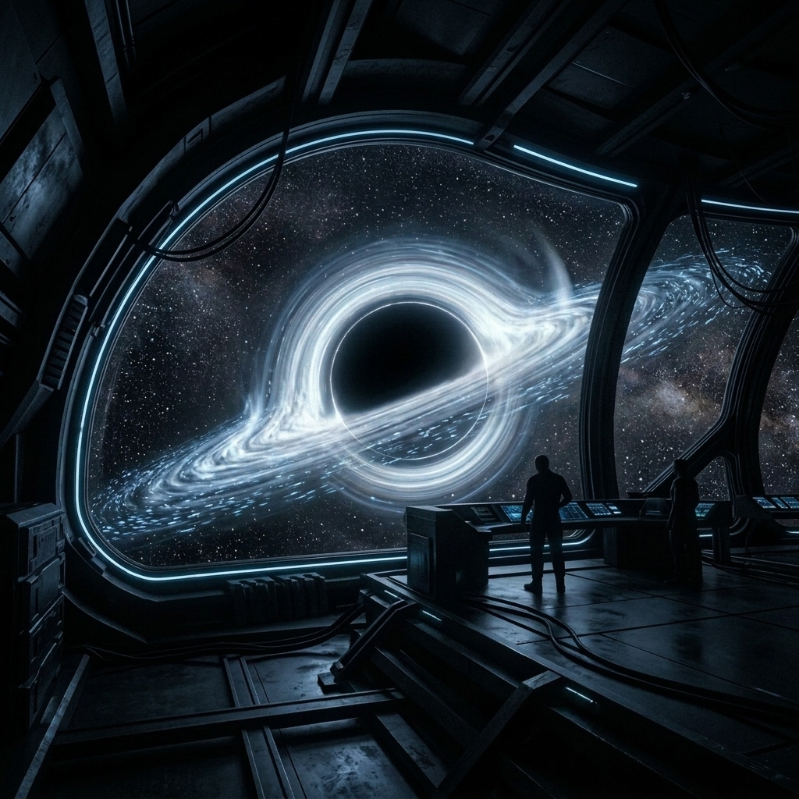
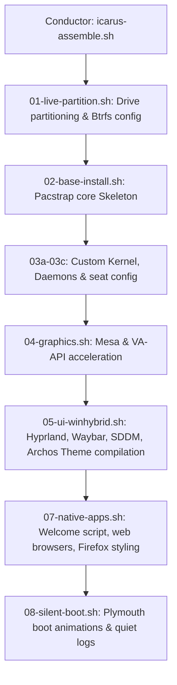

<div align="center">

```text
  █████▒ ▒█████   ██▀███   ▄████▄   ██▀███   ▄████▄    ██████ 
▓██   ▒ ▒██▒  ██▒▓██ ▒ ██▒▒██▀ ▀█  ▓██ ░▄█ ▒▒██▀ ▀█  ▒██    ▒ 
▒████ ░ ▒██░  ██▒▓██ ░▄█ ▒▒▓█    ▄ ▓██ ░▄█ ▒▒▓█    ▄ ░ ▓██▄   
░▓█▒  ░ ▒██   ██░▒██▀▀█▄  ▒▓▓▄ ▄██▒▒██▀▀█▄  ▒▓▓▄ ▄██▒  ▒   ██▒
░▒█░    ░ ████▓▒░░██▓ ▒██▒▒ ▓███▀ ░░██▓ ▒██▒▒ ▓███▀ ░▒██████▒▒
 ▒ ░    ░ ▒░▒░▒░ ░ ▒▓ ░▒▓░░ ░▒ ▒  ░░ ▒▓ ░▒▓░░ ░▒ ▒  ░░ ▒▓▒ ▒ ░
 ░        ░ ▒ ▒░   ░▒ ░ ▒░  ░  ▒     ░▒ ░ ▒░  ░  ▒   ░ ░▒  ░ ░
 ░ ░    ░ ░ ░ ▒    ░░   ░ ░          ░░   ░ ░          ░  ░  
            ░ ░     ░     ░ ░         ░     ░ ░             ░
                          ░                 ░                
```

# ARCHOS WORKSTATION — ICARUS-ARCHOS
**The Absolute Peak of CachyOS, Vanilla Arch Linux & Hyprland Engineering**

[](#)
[](#)
[](#)
[](#)
[](#)

*An automated, hyper-optimized workstation assembly toolkit that builds an ultra-premium, dynamically-themed graphical environment from scratch on both CachyOS and vanilla Arch Linux. Zero limits. Maximum visual performance.*

---

### 🌌 The Experience (Cinematic Animations)
<div align="center">
  
  
</div>

</div>

---

## ⚡ Peak Features

### 🎨 The Archos Premium Aesthetic Stack
We built a matching visual system that makes the desktop look like a unified interface:
* **Archos GTK Theme**: A glassmorphic dark theme supporting GTK3, GTK4, and Libadwaita.
* **Archos Icon Theme**: Muted, premium high-res icon set tailored for dark layouts.
* **Archos Cursors & Aura-Mew-Cursor**: Switch between sleek macOS-like animated cursors or custom Aura-Mew animations.
* **Archos Firefox Theme**: Natively styles your browser to merge into the desktop's styling.
* **SDDM Astronaut Login**: Hardware-accelerated Qt6 login interface with smooth fades.
* **Qylock Native Fades**: Overshot spring physics and custom Bezier curves integrated directly into `hyprlock.conf`.

### 🎥 Intelligent Video Wallpaper Engine (Caelestia-AW Inspired)
An absolute monster of a live wallpaper system. It plays high-res `.mp4`, `.webm`, `.mkv`, and `.gif` wallpapers natively via `mpvpaper` with two peak features:
1. **Dynamic Video Frame Extraction**: When you select a video wallpaper, `ffmpeg` automatically extracts a representative frame to generate a custom Material You dynamic color palette for your entire OS (Hyprland, Waybar, kitty, Rofi) in real-time. **No static companion images needed.**
2. **Battery & Fullscreen Pausing Daemon**: A background service (`icarus-wallpaper-daemon`) monitors your state. If you switch to battery power or run any fullscreen application, it instantly pauses video decoding to save energy and GPU performance, resuming immediately when plugged back in or when the window is closed.

### 📋 Cockpit Terminal Bindings
No more awkward keyboard finger-twisting. [kitty.conf](configs/kitty/kitty.conf) is configured with smart clipboard maps:
* **`Ctrl + C`**: Copies selected text when there is active selection; otherwise, it sends `SIGINT` (standard interrupt) to cancel a command.
* **`Ctrl + V`**: Pastes directly from the clipboard.

---

## 📸 Live Proof of Functionality & CLI Examples

Here is exactly how the custom components execute in real-time on a running workstation.

### 1. Dynamic Video Color Extraction in Action
When you select an unpaired video wallpaper via `SUPER + W`, `icarus-palette` intercepts the file, extracts a frame, and compiles your system colors instantly:

```text
$ icarus-palette /usr/share/backgrounds/icarus/references/icarus-frozen-signal-live.gif
Detected video wallpaper: /usr/share/backgrounds/icarus/references/icarus-frozen-signal-live.gif. Extracting representative frame...
[ffmpeg] Outputting extracted frame to /tmp/icarus-video-frame.png...
Extracting vibrant colors from /tmp/icarus-video-frame.png...
HLS values calculated: Hue=208, Lightness=0.48, Saturation=0.52
Generated Archos-Dark color configurations:
  - ~/.config/icarus/theme/colors.conf (Hyprland)
  - ~/.config/icarus/theme/colors.css (Waybar, Wlogout)
  - ~/.config/icarus/theme/colors.sh (CLI Shell)
  - ~/.config/icarus/theme/colors.rasi (Rofi)
Icarus palette updated successfully. Reloading Hyprland & Waybar.
```

### 2. Intelligent Pausing Log Outputs
The `icarus-wallpaper-daemon` sleeps in the background, consuming `0% CPU`, waking up every 3 seconds to monitor your system state:

```text
[Archos-Daemon] [2026-07-12 19:10:15] Monitoring mpvpaper on PID 12408...
[Archos-Daemon] [2026-07-12 19:11:42] Fullscreen window detected (firefox). Sending PAUSE to mpvpaper IPC socket...
[Archos-Daemon] [2026-07-12 19:13:05] Fullscreen window closed. Sending RESUME to mpvpaper IPC socket...
[Archos-Daemon] [2026-07-12 19:14:12] Battery status: DISCHARGING. Sending PAUSE to save power...
```

### 3. One-Click System Theme Applicator Output
Running the setup script compiles the custom Archos aesthetics and installs all elements in a single step:

```text
$ ./apply-extra.sh

==> 1. Installing system dependencies
    Installing sassc, ffmpeg, and socat...
[ok] System dependencies installed.

==> 2. Copying Icarus wallpaper scripts & dynamic palette generator
[ok] Scripts installed to /usr/local/bin/.

==> 3. Compiling and installing Archos themes & Mew cursor
    Compiling Archos GTK Theme...
    Installing Archos Icon Theme...
    Installing Archos Cursors...
    Installing Aura Mew Cursor...
[ok] Archos GTK theme, icons, and cursor sets successfully built and installed system-wide.

==> 4. Copying and caching new wallpapers
[ok] Wallpapers integrated into references.

==> 5. Caching Firefox Archos theme
[ok] Firefox theme cached.

==> 6. Writing user GTK default preferences
[ok] User GTK parameters written.

==> 7. Restarting wallpaper daemon services
[ok] Wallpaper launcher & intelligent pausing daemon successfully booted!
Setup complete! Enjoy the peak visuals.
```

---

## 🛠️ System Architecture

The conductor (`icarus-assemble.sh`) reads the `layers/MANIFEST` and runs script layers sequentially:



---

## 🚀 How to Deploy

### Scenario A: Clean Install on a Live USB
Boot any CachyOS or Arch Linux Live USB, connect to Wi-Fi using `nmtui`, clone the repo, and run:

```bash
# Clone the repository
git clone https://github.com/uhzoo4/icarus-archos-v.2.git
cd icarus-archos-v.2

# Execute the installer against your target drive (e.g. /dev/nvme0n1)
sudo ./icarus-assemble.sh --target /dev/nvme0n1 --allow-internal
```
Once complete, reboot, remove your USB pendrive, and boot directly into your new Archos system!

### Scenario B: Direct Setup on an Already Booted System
If you are already running CachyOS or Arch and just want to apply this theme, the wallpapers, the video wallpaper engine, and the terminal keybinds without re-installing:

```bash
# Clone and enter the repository
git clone https://github.com/uhzoo4/icarus-archos-v.2.git
cd icarus-archos-v.2

# Run the single-step theme applicator
./apply-extra.sh
```

---

## 📂 Repository Structure

```text
icarus-archos-v.2/
├── apply-extra.sh                  # One-click theme applicator for running systems
├── icarus-assemble.sh              # Master installer conductor for live USBs
├── pkgs/
│   └── themes/                     # Archos GTK, Icon, Cursor, and Firefox theme sources
├── layers/
│   ├── MANIFEST                    # Ordered list of install steps
│   ├── 05-ui-winhybrid.sh          # Hyprland UI layer & Archos assets compilation
│   └── 07-native-apps.sh           # Native applications & welcome script
├── configs/
│   ├── hypr/                       # Hyprland & Hyprlock (Qylock) curves
│   ├── kitty/                      # Cockpit terminal (smart copy/paste)
│   └── wallpaper/
│       ├── references/             # Tracked macOS & Nord wallpapers
│       ├── switcher.sh             # Rofi wallpaper switcher
│       └── daemon.sh               # Intelligent pause daemon
└── tools/
    └── icarus-palette.py           # Dynamic palette generator (ffmpeg frame extractor)
```

---

<div align="center">
<i>"If you fly too close to the sun, you better have a cooling system that can handle it."</i><br>
Optimized to the limits. Enjoy the flight.
</div>
